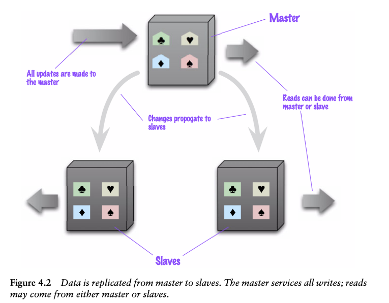
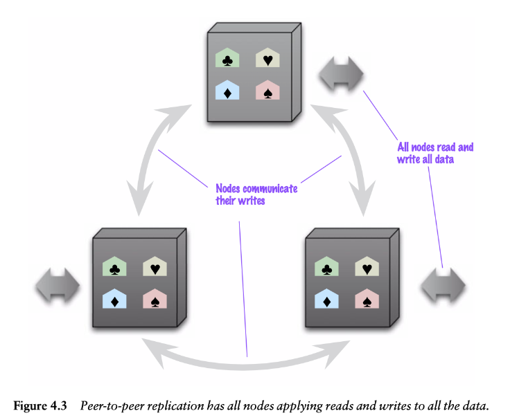
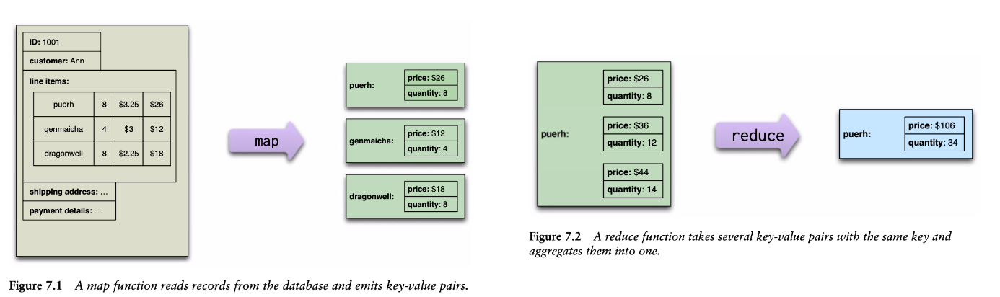

# NoSQL Concepts and Technologies

These questions will focus on evaluating the understanding of the principles, concepts, and technologies related to NoSQL.

## Topics:
 - Motivation for the emergence of NoSQL solutions;
 - Understanding of concepts such as “aggregates” or “impedance mismatch”;
 - Distribution models and strategies;
 - Consistency in NoSQL databases;
 - Distributed data processing.

## Questions

###  1 - What is an “aggregate”? What relation can be established with “data normalization”?

An **aggregate** refers to a complex data structure that encapsulates a collection of related objects treated as a single unit. This unit can include nested records, lists and other aggregate entities, making it a flexible and comprehensive way to represent data. Aggregates are typically used in aggregate-oriented databases, such as document-oriented or key-value stores in the NoSQL family, to manage data in a manner that aligns with application needs rather than strict relational models.

**Data Normalization** is a process used in relational databases to reduce redundancy and dependency by organizing data into multiple related tables. The primary goal is to ensure data integrity and avoid anomalies during data operations.

#### Differences and Relations

- Normalization tries to remove redundancy by dividing data into related tables, however, aggregates try to encapsulate all the data needed in one access/operation in a single unit (aggregate), reduce the need for multiple data accesses and multi-aggregate operations.

- Normalization promotes a tabular structure with a strict schema and relationships defined by foreign keys, however, aggregates use flexible hierarchical structures that can include more complex structures, such as nested records and lists.

- Normalization optimizes for storage efficiency and data integrity, often leading to more complex operations, such as joins. Aggregates optimize for read efficiency, often at the cost of increased storage due to denormalization.

- Normalization achieves consistency through constraints and relationships across multiple tables. Aggregates achieve consistency within the bounderies of an aggregate, often using atomic operations on the whole unit.

---

###   2 - What are “aggregate-aware” models? Describe advantages and limitations of these models? 

An aggregate-aware model is a data model designed to recognize and optimize for aggregates, which are complex unit of data indexed by a key that can be used for lookup.
These models are commonly used in NoSQL databases, such as document-oriented, key-value and column-family stores. Aggregate-aware databases understand the boundaries of aggregates and optimize for storage, retrieval and consistency management around these units.

#### Advantages

- **Performance**
    - **Optimized Reads:** Data retrieval is often faster, because related data is usually stored together in a single aggregate.
    - **Efficient Writes:** Aggregates minimize the need for multiple write operations across different tables

- **Scalability**
    - **Horizontal Scaling:** Aggregate-aware databases are designed to scale out by distributing data that is stored together in a single aggregate. The database will ensure that the data for an aggregate is stored together in one node.

- **Developer Productivity**
    - Developers can interact with data in a more natural way, retrieving data without complex joins most of the times. More than that, usually (it depends, yes), aggregates represent a more ""touchable"" concept than tables in the relational data model, therefore being easier to develop with.

- **Flexibility**
    - **Schema Evolution:** Easier to evolve the schema as the structure aggregates are usually more flexible that rigid relational schemas.
    - **Complex data Models:** Aggregate-aware models are more suitable for complex data models with nested structures and arrays.

#### Limitations

- **Data Redundancy**
    - Even though this is a well known tradeoff, since aggregates often contain redundant data, that can lead to increased storage overtime and potential data inconsistency issues if not deal with correctly at the applicational level.

- **Complexity in certain queries**
    - **Cross-Aggregate Queries:** Performing queries that span multiple aggregates can be complixated and less efficient than in relational databases. (Note that this is also really dependent on the design of the schema and the tradeoffs made by the database admin).
    - **Lack of Joins:** Aggregate-Aware databases often do not support native joins, requiring developers to handle relationships in the application logic.

- **Consistency Tradeoffs**
    - **Eventual Consistency:** Many aggregate-aware databases favor eventual consistency, which can be a limitation for application requiring strong consistency guarantees.
    - **Complex Consistency Management:** Managing consistency across aggregates may be complex and require additional mechanisms such distributed transactions or logic to check consistency at the applicational level.

- **Schema Design Complexity**
    - Designing aggregate-aware schemas is not an easy and dterministic task and has a lot of tradeoffs which need to be taken into account depending on the specific scope of the application. Determining the optimal boundaries of an aggregate can be complex and requires careful consideration of data access patterns. Developers need to have a good understanding of how data will by used by the application to design effective aggregates. 
---

###   3 - Identify three reasons that motivated the development of NoSQL solutions. Why aren’t relational databases a viable approach in these cases? 

- **Object-relational mismatch:** In the relational data model, data is organized and manipulated using relationships (sets of tuples, aka name-value pairs), which only allows for simple structures (e.g.: they can't contain nested elements).

- **Dificulty to scale up or out:** As infrastructures moved towards cluster, relational database solutions revealed scaling problems adapting as they rely on shared disk subsystems (can be solved through sharding, but it's unnatural).
The mismatch between rdbms and clusters led to the development of alterantive routes for data storage solutions.

- **Scalability**
    - In centralized RDBMS its difficult to scale out (more machines) and scaling up (better machines) is expensive and has limits.
    - NoSQL solutions are designed to be implemented in clusters, thus scaling out is supported by design.

- **Cost**
    - Multiple licensing formulas exist (by users, cores, etc.), none of which adequate for varying loads (e.g. web).
    - The majority of NoSQL solutions are open-source, avoiding this issues.

- **Flexibility**
    - Relational databases require strong investments in the initial design and changes to the schema has costs.
    - Some NoSQL databases are schemaless in the sense that they do not require fixed structures.

- **Availability**
    - Centralized RDBMS typically have single points of failure, thus demand higher infrastructure investments.
    - Most NoSQL database are designed to take advantage of multiple low-cost servers, and adapt by design to failures.
---

###   4 - Explain the CAP theorem and provide a real-word example to illustrate its application. 

CAP which stands out of **C**onsistency **A**vailability and **P**artition Tolerance is a theorem that states that any distributed data store can only provide 2 of those 3 attributes.

**Consistency:** Every read received the most recent write without an error.

**Availability:** Every request received by a non-failing node in the system must result in a response.

**Partition Tolerance:** The system continues to operate despite an arbitrary number of messages being droppde (or delayed) by the network nodes.

When a network partition failure happens, it must be decided wether to do one of the following:
    - cancel the operation and thus decrease the availability but ensure consistency.
    - proceed with the operation and thus provide availability but risk inconsistency.

Thus, if there is a network partition, one has to choose between consistency and availability.

##### Real world example: Apache Cassandra

Cassandra is a distributed NoSQL database designed to handle large amounts of data across many commodity servers. It is as example of a system that trased off consistency for availability and partition tolerance.

- **Partition Tolerance:** Cassandra is designed to be highly tolerant to network partitions. It can handle failures or delays and still provide services by allowing nodes to operate independently.

- **Availability:** Cassandra prioritized availability. Even if somes nodes are unreachable due to a network partition, the remaining nodes continue toaccept read and write requests. This ensures that the system is always available to serve clients.

- **Consistency:** To achieve high availability and partition tolerance, Cassandra sacrifices consistency. Instead, it offers tunable consistency levels, allowing users to choose the consistency level for each operation. For example, a user can specify wether a read should return the latest value written (strong consistency) or if it can return a value that might be slightly out of date (eventual consistency)

---

###   5 - Define the concept of “sharding” as a data distribution strategy. Provide an application example to illustrate this technique. 

Sharding is a method for distributing a single dataset across multiple databases, which can then be stored on multiple machines. This allows for larget datasets to be split into smaller chunks and stored in multiple data nodes, increasing the total storage capcity of the system.

Sharding a data distribution technique that supports horizontal scalability, where different parts of the data are put into different servers. Horizontal scaling allows for near-limitless scalability to handle big-data and intense workloads.

This is suitable for "disjoin workloads", i.e. different peioke typically access different parts of the dataset.

For example, a rabge-based sharding could be used in a social media platform sharding user data by ID, storing users with IDs 1-1,000,000 on Server A, 1,000,000-2,000,000 on Server B, and so on. This allows for efficient handle of big data loads and disjoint workloads, as different users typically access different parts of the dataset (meaning that operations on one shard typically do not impact the other), enabling seamless scalability and performance optimization.

---

###   6 - Identify and describe different replication strategies commonly found in NoSQL solutions. 

#### Primary-Replica Replication

- In primary-replica, one node is designated as the primary and is the authoritative source for the data and usually responsible for processing updates to that data. The other nodes are the replicas (or secondary nodes).

- Most adequate for "read-intensive" scenarios

- Horizontal scaling is handled by adding more replica nodes and ensuring that all read requests are routed to the replicas.

- Not ideal for heavy write traffic.

- Improves read resilience:
    - If primary fails, read operations can still be handled by the replicas, although writes cannot be answered.

- Primary recovery is made easier since a replica can be appointed as primary.

- Inconsistency is a risk:
    - Different clients reading from different replicas and seeing different values, because changes haven't propagated to all replicas.

#### Peer-to-Peer Replication

- In primary replica, the primary node is a single point of failure and a bottleneck. With peer-to-peer these problems are addressed because there is no primary node:
    - All replicas have equal responsibilities (they can accept reads and writes)

- Inconsistency is still a risk:
    - When it's possible to write to two different places there is a risk of having update attempts to the same record at the same time, resulting in a write-write conflict. Avoiding this conflicts requires more coordination.

#####   Primary-replica  approach reduces the changes of update conflicts, but peer-to-peer replication avoids loading all writes onto a single point of failure. 

---

###   7 - What are optimistic and pessimistic approaches to conflict resolution? 

When we have conflicts, we need to deal with them in some way. Two of the possible approaches to do so are:

- **Pessimistic approach:** assumes conflicts are common and prevents them by locking resources before accessing them. Transactions must wait for locks to be released

    - **Advantages:** Ensures consistency by preventing conflicts from occurring.
    - **Limitations:** Lower concurrency and potential for deadlocks, as transactions may be delayed while waiting for locks.

- **Optimistic approach:** Assumes conflicts are rare and allows transactions to proceed without locking resources. Conflicts are detected and resolved only when the transaction is committed.

    - **Advantages:** Higher concurrency and performance, as transactions
    - **Limitations:** Potential for higher overhead due to conflict detection and resolution, and increased likelihood of transaction rollbacks.

Choosing between this conflict resolutions mechanisms is a tradeoff between safety (avoiding errors) and responsiveness. Using a single node as the target for all writes simplifies maintaining consistency a lot.
---

## Others

### What is impedance mismatch?

In the context of information systems, impedance mismatch refers to the difference between distinct data representations, most notably between the relational model an in-memory structures.

Impedance mismatch happens when two different representations require translation (e.g.: an order, which looks like a single aggregrate structure in the UI is split into many rows from many tables in a relational database.)

### What is ACID?

ACID stands for **A**tomicity, **C**onsistency, **I**solation and **D**urability. These are the four key properties that ensure reliable processing of database transactions.

- **Atomicity:** This ensures that a series of database operations within a transaction are either all completed successfully or none are applied. In other words, a transaction is treated as a single, indivisible unit. If any part of the transaction fails, the entire transaction is rolled back, leaving the database unchanged.

- **Consistency:** This property ensures that a transaction takes the database from one valid state to another valid state, maintaining database invariantes. After a transation, the database must remain in a consistent state where all predefined rules, such as integrity constraints, are satisfied.

- **Isolation:** This ensures that concurrently executed transactions do not interfere with eachother. Transactions are isolated from one another, meaning the intermediate state of a transaction is not visisble to other transactions until it is commited. This prevents issues such as dirty reads, non-repeatable reads, and phantom reads.

- **Durability:** This guarantees that once a transaction has been committed, it will remain committed even in the even of a system failure. This means that the changes made by the transaction are permanently recorded in the database.

### What is eventual consistency?

Eventual consistency is a guarantee that when an update is made in a distributed database, that update will eventually be reflected in all nodes that store the data, resulting in the same response everytime the data is queried.

Consistency refers to a database query returning the same data each time the same request is made.
Strong consistency means the latest data is returned, but, due to internal consistency methods, it may result with higher latency or delay. With eventual consistency, results are less consistent early on, but they are provided much faster with low latency. Early results of eventual consistency data queries may not have the most recent updates because it takes time for updates to reach replicas across a database cluster.

A key benefit of an eventually consistent database is that it supports the high availability model of nosql.

### Combining Sharding and Replication

- Replication and sharding strategies can be combined.
    - With sharding and primary-replica distribution, multiple primaries exist, but each
    - With sharding and peer-to-peer, each shard is replicated in multiple nodes (e.g. 3).

### Consistency

- **Write-write conflicts** exist when two clients try to write the same data at the same time.

- **Read-write conflicts** occur when one client reads inconsistent data in the middle of another client's write.

- Reading non-updated or partially updated data results
in **read-write conflicts or inconsistent reads**.

- **Replication Consistency**, is ensuring that the same data item has the same value when read from different replicas.

- **Session Consistency:** In settings with eventual consistency, a common approach is to provide session consistency (i.e. provide **read-your-write consistency** within a user's session), which means that a client can write and immediatly read the new value. This can be difficult if the read and write happen on different nodes.

### Quorums

- Quorums can be used to deal with consistency levels.

- To achieve strong consistency it is not necessary to have acknowledge from all nodes

- In **write-quorums**, write consistency can be achieved if the number of nodes participating in the write is more than half of the nodes involved in the replication. (W > N / 2)

- In **read-quorums**, strong consistency reads can be assured if the number of nodes needed to be contacted for a read (R) plus tgose confirming a write (W) is greater than the replication factor (N): R + W > N.

### Distributed Data Processing

- Clusters do not only impact data storage, they also impact data processing.

- With a **centralized database**, data processing can be done on:
    - **Database server:** less programming convenience; higher load on the server; lower data transfers;
    - **Client machines:** flexible programming environment; higher load on clients; increases data transfers.
    
- With a **distributed system**, more computational power exists, but minimizing data transfer across the nodes is essential.

- **Goal:** keep as much processing and the data needed together on the same node.

#### Map-Reduce Pattern

- The map-reduce pattern is a way to organize processing to take advantage of multiple machines available on a cluster.

- A **map-reduce** process has **two core operations**:
    - A **map operation** that takes a single aggregate and outputs several key-value pairs.
    - A **reduce operation** that takes multiple map outputs with the same key and combines their values.

- The first stage of a map-reduce job is the **map operation**:
    - A map function takes an aggregate as input and outputs key-value pairs.
    - Each execution of the map function is independent of all the others, thus parallelizable.
    - Map tasks can be executed on each node, gaining **parallelism** and **data locality**.

- The second state is the **reduce operation**:
    - A reduce function takes multiple maps outputs with the same key and combines their values.
    - A reduce task uses values emitted for a single key.

- The map-reduce framework collects all the values for a single pair and calls the reduce function with the key and the collection of all the values for that key.

- Map-reduce jobs can be partitioned to allow reduce functions to run in parallel.

- The map-reduce approach trades off flexibility in how data is structured for simplicity in how data processing is parallelized and executed.
    - Within a map task it is only possible to operate on a single aggregate.
    - Within a reduce task it is only possible to operate on a single key.

- Data structures and algorithms need to be organized to fit in this context.