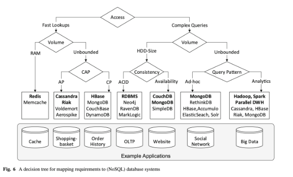

# NoSQL Concepts and Technologies

These questions will focus on evaluating the understanding of each of the four paradigms studied – key-value, document, column-family, and graph.

## Topics:
 - Characteristics and features of each paradigm;
 - Suitable (and challenging) use cases for each paradigm;
 - Data modeling concepts and structured in each paradigm;
 - Query language features in each paradigm;
 - Data distribution and data consistency characteristics in each paradigm. 

## Index

- [Key-Value Databases](key-val.md)
- [Document Databases](document.md)
- [Column-Family Databases](column-family.md)
- [Graph Databases](graph.md)

## Other

### NoSQL decision guide

