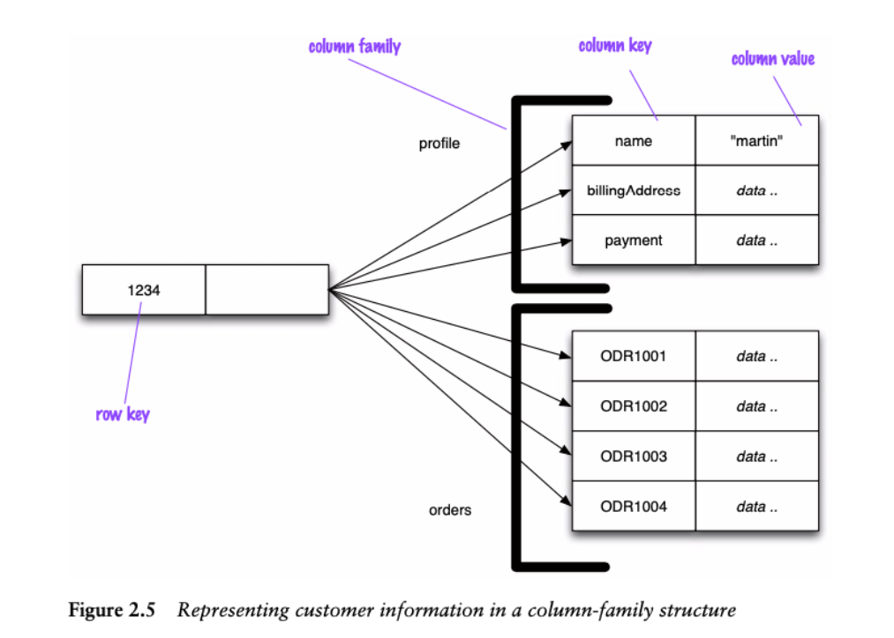
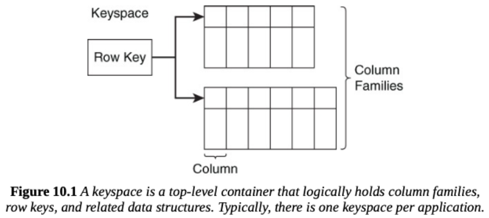

# Column Family Databases (aka wide-column)

## Questions

### When should columns be grouped together in a column-family?
Columns should be grouped together in a column family if they are frequently accessed together in queries. This improves read performance by allowing the database to retrieve all the necessary data in a single read operation, instead of needing to do various reads on multiple aggregates. Additionally, columns that logically belong together, user as user profile information should be grouped in the same column family to maintain data organization and coherence.

#### Describe how to model a one-to-one association in a column-family database.
An one-to-one relationship in a column family database can be modeled by storing related entities in the same row or in separate rows with an unique identifier that links them together (worse, but as always, it depends).

#### Describe how to model an one-to-many association in a column-family database.

In a column-family database, an one-to-many relationship can be modeled by having a single row in one column family that contains a collection of columns or a list of keys that reference multiple rows in another column.

For example, if a user can have multiple orders, the user's row might have a column that stores a list of order ids, with each order ID referencing a separate row in the orders column-family.

#### Describe how to model a many-to-many association in a column-family database.

To model a many-to-many association in a column-family database, you typically use two column-families to represent the relationship. One column-family contains rows for each entity type with a list of references to the related entities.
For example, if students and courses have a manu-to-many relationship, there would be a students column family with columns listing course IDs for each student and a courses column-family with columns listing student IDs for each course.

Note: Can also be done by using more column-families with different tradeoffs.

#### Describe use cases that are particularly well-suited for column-family databases.

- Scenarios with **large volumes of data** (petabyte scale).
    - Since data can easily be partitioned both horizontally (by rows) and vertically (by column families)

- **High scalability and high availability requirements** in both **reads and writes** (but **no transactions**).
    - Column-family databases support both read and write distribution.

- **Disjoint data access** patterns.
    - The partition options with various aggregate levels makes data distribution easier.

- **Geographical distribution**
    - Can be replicated across multiple data centers, e.g. distributed user base.

Examples of applications where column-family databases could be useful are: **event logging**, **counters / analytics**, **big data processing (with MapReduce)**

##### Example: Event Logging

- Column-family databases are able to store any data structures, thus a good option to collect event information from multiple sources.
- Within the enterprise, all applications can write their events to Cassandra with their
own column and the rowkey of the form [ appname:timestamp ].
- Since writes can be scaled, this makes Cassandra a good option.

#### Identify characteristics that pose challenges when using column-family databases.
- Early prototype development where the data access patterns are not clear or may change.
- Requirements for ACID transactions for reads and writes.
- Need for whole tuple updates (i.e. where writes need to be done into multiple column families).
- Need for aggregate queries (e.g. SUM or AVG), which require that all data is retrieved to the client from all rows.

Column-databases impose a higher cost on query changes compared to schema changes.

## Other

- Data is stored in multidimensional structures.
- Data objects are accessed with object keys (first-level mapping).
- Object properties (columns) are accessed with column keys (second-level mapping).
- Columns can be grouped into column families.
- Suitable for high scalability and high availability contexts.
- Offers high control over the localization of distributed data on the column-family level.
- High flexibility at the column-family level - an arbitrary number of columns that can be dynamically created.
- Supports both read and write replication, thus suitable for high scalability contexts
- Not suitable for complex use cases where cross column-family operations needs to be atomic.
- SQL-like query language (at the syntax level; the underlying logic is completely different).

---

- Two-level aggregate structure
    - First level access is identical to a key-value store, where keys are used to select aggregates.
    - Second level access allows direct selection of individual columns or column aggregates. 

- Acess is possible at various aggregate levels: record, column, column-family.

 

A **row** corresponds to a complete data record and is composed by: 
- an unique **key** (at the top level data-structure, the keyspace)
- a collection of **column families**

- Each **column family** is composed by:
    - a **column family key**;
    - a set of **columns**, representing related data;

- The **column** is the basic data item, and is composed by:
    - a **column key**;
    - a **value**;
    - a **timestamp**, which is used to expire data, resolve write conflicts, etc.

- Transaction are supported at the row level.