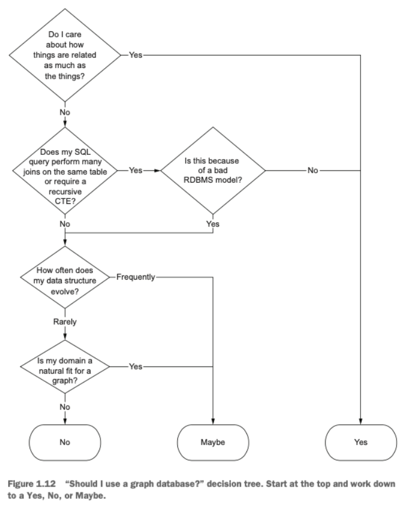

# Graph Databases

## Questions

### How do graph databases avoid joins?
Graph databases avoid joins by storing relationships as first-class citizens within the database (they are relationship-oriented instead of aggregate-oriented).
Instead of using foreign keys and performing complex joins to traverse relationships, graph databases use direct pointers to other nodes. This means that querying related data involves following this "pointer", which is a more efficient process, especially as the dataset grows.

### Provide an example of when to use a weighted graph.

A weighted graph is particularly useful in scenarios where relationships between nodes have different strengths or costs. One common example is in transportation networks, such as road maps or flight routes, where edges (representing roads or flights) have weights corresponding to distances, travel times or costs. Using a weighted graph in this context allows for the calculation of optimal paths, such as the shortest route or the least expensive travel plan.

Another example is on networking systems, such as in routing algorithms (like BGP). If vertices represent routers and edges represent the physical network paths, since there are a lot of redundant paths, if there are weights (calculated with base on cost, latency, etc.), we can easily develop an algorithm to choose the better path and adapt in depending on the current needs.

#### Describe how to model a one-to-one association in a graph database.
n a graph database, a one-to-one association is modeled by creating two nodes that represent the entities involved and a single directed or undirected edge between them

#### Describe how to model a one-to-many association in a graph database.
To model a one-to-many association in a graph database, you create a single node representing the entity on the "one" side of the relationship, and multiple nodes representing the entities on the "many" side. Then, you create directed edges from the single node to each of the nodes on the "many" side. 

#### Describe how to model a many-to-many association in a graph database.
Modeling a many-to-many association in a graph database involves creating nodes for each entity and connecting them with edges that represent the relationships. Each node on one side of the relationship can have multiple edges connecting to multiple nodes on the other side.

#### Describe use cases that are particularly well-suited for graph databases.

- Problems with complex domains and querying needs.
- Complex data models
- Multiple co-existing domains; 
- Strongly connected data.
    - Social networks have a directed mapping with graph-based representations
    - Any link-rich domain is well suited for graph databases.

Since graph databases strengths include its **fast and simple querying of linked datasets** and its powerful **modeling language**, examples of use cases for them are **connected data**, **location-based services**, **social networks** and **recommendation engines**.

##### Example: Recommendation Engines

- Since nodes and relationships are stored, they can be used to make recommendations, like:
    - "people who purchased X, also viewed Y"
    - "visitors who visited A, also visited location B"

- As the size of the data grows, the number of nodes and relationships quickly increases.

- This data can also be used for data analysis and detect patterns, e.g. trigger actions when patterns are met.

#### Identify characteristics that pose challenges when using graph databases.

- There is no standard query language;
- Difficult to scale due to high connectivity;

- When it is needed to update all or subsets of entities - e.g. a property is changed for all entities (this is not as straightforward).
- Large volume contexts, particularly requiring aggregation operations (e.g., averages, counts), may not be feasible.
- Strong scalability requirements, since graph databases are not aggregate-oriented.

## Other

- Data is modeled as entities (nodes) and relationships (edges).
- Nodes and relationships can have associated attributes.
- Solid theoretical foundation on the field of graph theory.
- Model is relationship-oriented, not aggregate-oriented.
- Schema optional model, i.e. data can be created without creating a schema up front.
- Powerful query languages (but not standard) to enable complex graph traverses.
- Suitable solution for complex domains (multiple concepts, multiple co-existing contexts).
- ACID transactions are supported at server level.
- Fast join or lookup operations over relationships.
- Horizontal scaling is difficult to achieve without application-level control.
- Horizontal read scaling is possible by adding read-only replicas.

---

- Graph databases store entities and relationships between these entities

- **Vertices/Nodes** represent the entities and; **Edges** represent the relationships.

- Graph databases are **relationship-oriented**, not aggregate-oriented.

