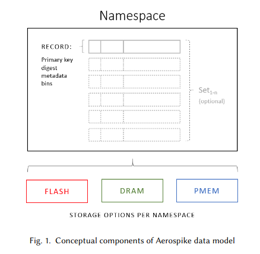

# Aerospike

- [Acess] : Fast Lookups -> [Volume] : Unbounded -> [CAP] : AP

- Favours **Availability** and **Partition-Tolerance**

- Aerospike is a technologie designed for high-throughput, real-time applications with "blazing-fast reads/writes and unmatched up-time".

- Licenses available:
    - Standard Edition
    - Enterprise Edition
    - Aerospike Cloud Managed Service (fixed rates)

## Main Features

### Multi-Model Support

- "Row-Oriented" Data Model, with each row representing a single record inside the database.
    - Each record has a Primary-Key and a set of "bins", each holding a particular value. These "bins" can be thought of as columns of a RDBMS.
    - By default, the PK is the only way to retrieve records from an instance.
    - Secondary indices can enable queries to be made on specific bins other than on the PK, which means that each key's value is not completely opaque to the data store.
    - Bins can hold scalar values or more complex data structures, such as JSON.

- Even though Aerospike has to some degree, some form of support for multiple data-modeling paradigms, the main one is the **Key-Value** paradigm.

### Schemaless Data Model
- Aerospike stores record data inside "bins", which are just containers for arbitrary values.
- Schema used by the database is not enforced by the database technology and is determined by its use.
- This flexibility allows applications to evolve their data structures effortlessly without users having to experience database downtime.

### Hybrid Memory Architecture
- Records in aerospike are stored inside namespaces
- A namespace is an object in aerospike that holds a "data-storage configuration" that is shared by all its records. Aerospike supports the following storage options:
    - Flash
    - DRAM
    - PMEM (Intel Octane)

- By operating close to physical hardware, and in a fashion similar to the physical operations happening in the physical storage components of a computer (obtained by coding design), Aerospike’s HMA is well-suited for real-time applications that require high throughput, low latency, and scalable storage capabilities

### Cross-Data-center Replication
- Aerospike’s cross-data-center replication (XDR) feature enables seamless data synchronization and disaster recovery across geographically distributed clusters, enabling applications to maintain uninterrupted operations in the event of localized outages or disasters.
- XDR ensures data consistency and availability by replicating data asynchronously or synchronously be-tween multiple data centers or regions

### APIs and Client Libraries

- **Smart Clients**
    - Smart routing of requests through Aerospike Cluster
    - Automatic network latency minimization through load balancing 

### Consistency Features
- Can be configured to **AP** or **CP**.
- By default, it is configured to prioritize availability and partition tolerance, with its Strong Consistency mode being only available to the Enterprise Edition and the Aerospike Cloud Managed Service.

### Replication Features
- Aerospike utilizes a combination of the Paxos consensus protocol and gossip-based communication for distributed replication.

### Data Processing Features

One of the features Aerospike provides that allows for powerful data processing capabilities is the presence of User Defined Functions, (UDF). These are Lua scripts that can run on the Aerospike server

These come in 2 variants:
    - Record UDFs
    - Stream UDFs

At first glance these look like Stored Procedures in classic RDBMS systems. However, UDFs are more limited in what they can do inside the database when compared to a normal Stored Procedure.

#### Record UDFs
Record UDFs run on a single record. They can implement all CRUD operations. They are used for:
    - Implementing features not yet present in the Aerospike server itself.
    - Executing many operations inside a transaction.
    - etc.

#### Stream UDFs
Stream UDFs, in contrast, execute on a stream of records in a read-only fashion. 

- Useful for aggregating and transforming query results (closest to Map-Reduce in Aerospike)

##  Adequate vs Inadequate Scenarios

As mentioned, Aerospike is designed to provide uninterrupted, low-latency, high-throughput service to client applications. As such, adequate use of Aerospike can involve contexts that require frequent data access.

Due to its hybrid memory architecture it can be used both as a datbase and a cache. This can be used along with the extension replication features that can allow Aerospike to run almost uninterrumpted across any cluster size.

- **aql** is used to inspect and modify database contents
- **asadm** allows management operations on a cluster, like creating indices

